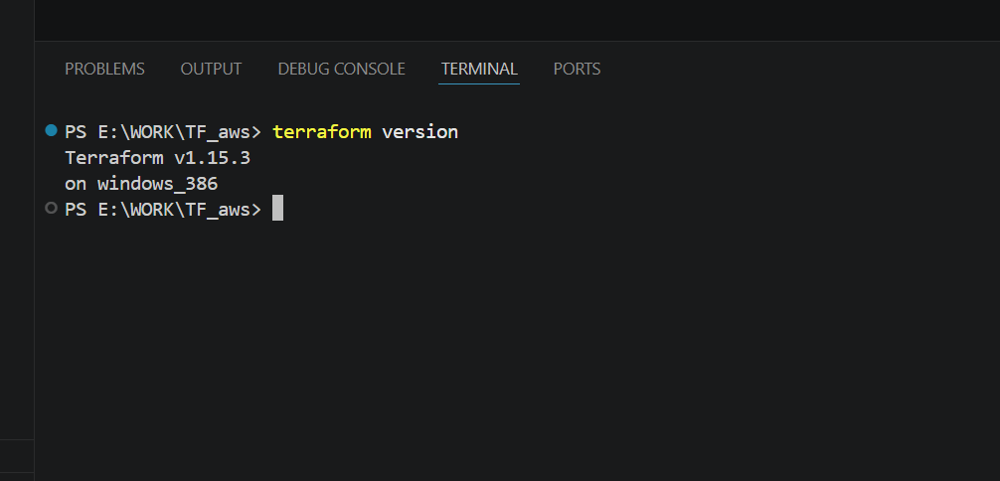
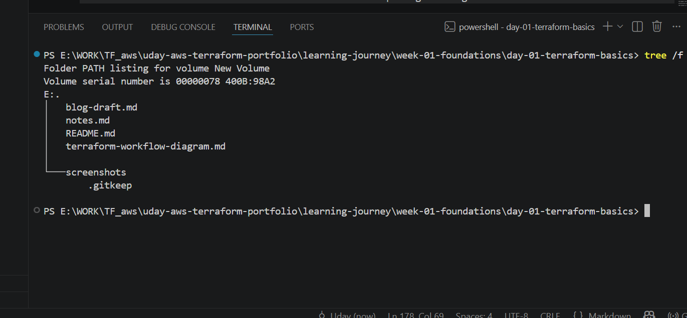
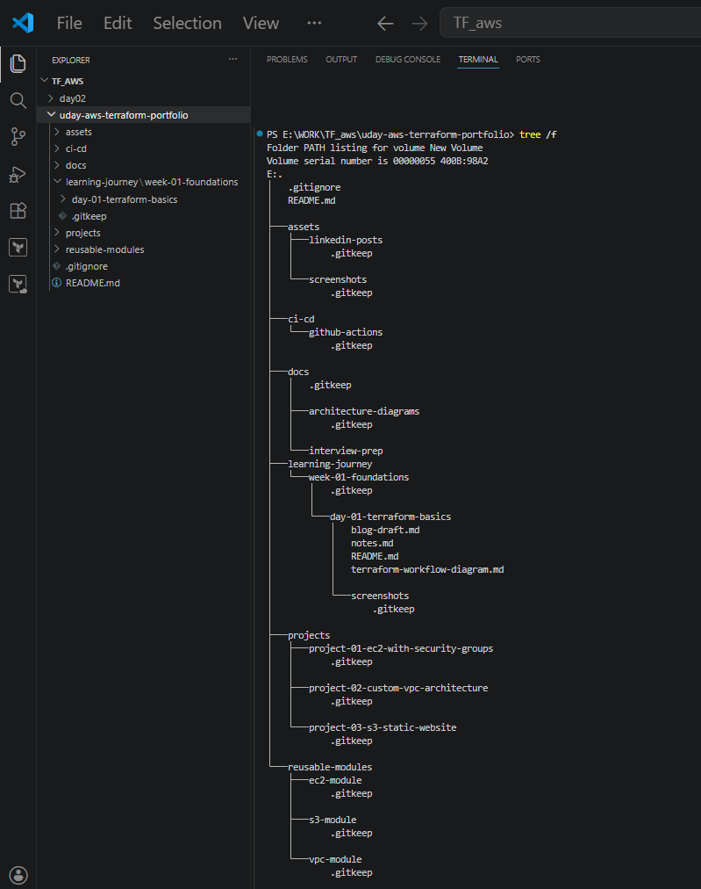

# Day 01 — Terraform Fundamentals

## Overview

Day 1 focused on building a strong foundation in Terraform and Infrastructure as Code (IaC).

The objective was to understand why infrastructure automation matters, how Terraform works internally, and how modern cloud engineers use Terraform to manage infrastructure efficiently.

This day focused on conceptual learning, technical documentation, portfolio setup, and workflow understanding before moving into real AWS infrastructure provisioning.

---

## Topics Covered

- Introduction to Infrastructure as Code (IaC)
- Traditional infrastructure management challenges
- Why Terraform is widely used in cloud engineering
- Terraform architecture and provider model
- Terraform lifecycle workflow
- Terraform installation and CLI setup
- Infrastructure automation mindset

---

## What I Learned

### Infrastructure as Code (IaC)

Infrastructure as Code (IaC) is the practice of managing and provisioning infrastructure through code instead of manual configuration.

Instead of manually creating cloud resources like:

- EC2 instances
- Security Groups
- S3 Buckets
- VPCs
- IAM Roles

Infrastructure can be described declaratively and deployed automatically.

### Benefits of IaC

- Consistent infrastructure deployments
- Repeatable environments
- Reduced human error
- Faster provisioning
- Better collaboration
- Version control for infrastructure
- Easier scaling
- Improved operational efficiency

---

### Challenges with Traditional Infrastructure Management

Manual infrastructure provisioning creates major operational issues:

- inconsistent environments
- manual configuration errors
- deployment delays
- poor scalability
- difficult troubleshooting
- no infrastructure version history
- configuration drift

Terraform solves these problems by introducing automation and reproducibility.

---

### What is Terraform?

Terraform is an open-source Infrastructure as Code tool developed by HashiCorp.

It enables engineers to define infrastructure declaratively and provision resources across multiple cloud providers.

Supported platforms include:

- AWS
- Microsoft Azure
- Google Cloud Platform
- Kubernetes
- VMware
- GitHub
- Cloudflare

---

## Terraform Workflow

Standard Terraform lifecycle:

```bash
terraform init
terraform validate
terraform plan
terraform apply
terraform destroy
```

### Command Purpose

**terraform init**
- Initializes Terraform working directory
- Downloads required provider plugins
- Prepares project for execution

**terraform validate**
- Checks configuration syntax
- Detects invalid Terraform definitions

**terraform plan**
- Generates infrastructure execution preview
- Shows planned changes before deployment

**terraform apply**
- Executes planned infrastructure changes
- Creates or modifies resources

**terraform destroy**
- Safely removes managed infrastructure
- Helps prevent unnecessary cloud costs

---

## Terraform Architecture Flow

```text
Terraform Configuration Files
            ↓
Terraform CLI
            ↓
Provider Plugin
            ↓
Cloud Provider API (AWS)
            ↓
Provisioned Infrastructure
```

---

## Practical Work Completed

Completed during Day 1:

- Installed Terraform on Windows
- Verified Terraform CLI installation
- Learned Terraform lifecycle workflow
- Created professional AWS Terraform portfolio repository
- Designed repository architecture for long-term learning
- Documented technical learning notes
- Created workflow explanation diagram
- Prepared Day 1 technical blog draft

---

## Repository Artifacts

| File | Purpose |
|------|---------|
| README.md | Day 1 technical documentation |
| notes.md | Personal learning notes |
| blog-draft.md | Blog submission draft |
| terraform-workflow-diagram.md | Workflow explanation |
| screenshots/ | Practical proof of work |

---

## Screenshots

### Terraform Installation Verification


### Day 1 Folder Structure


### Portfolio Architecture


---

## Skills Demonstrated

Day 1 reflects foundational skills in:

- Infrastructure as Code
- Terraform fundamentals
- CLI tooling
- Git & GitHub workflow
- technical documentation
- repository organization
- cloud engineering discipline

---

## Key Takeaway

The most important lesson from Day 1:

Infrastructure should be treated as code—not as a manual operational process.

That mindset is fundamental for modern Cloud Engineering and DevOps practices.

---

## Next Step

Proceeding to Day 02: Terraform Providers and AWS integration.