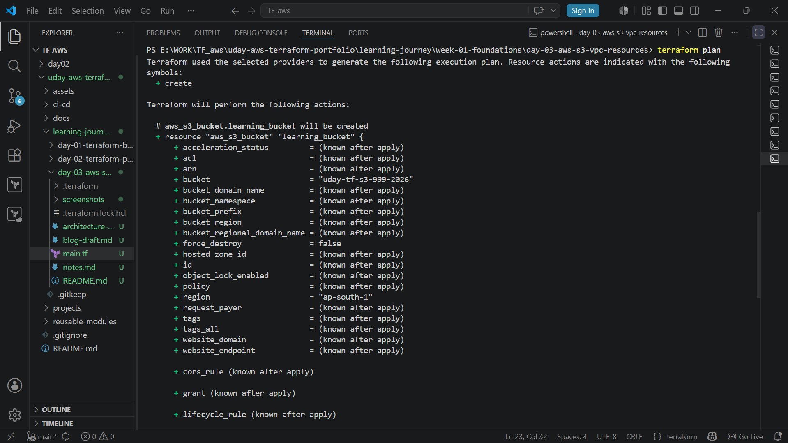
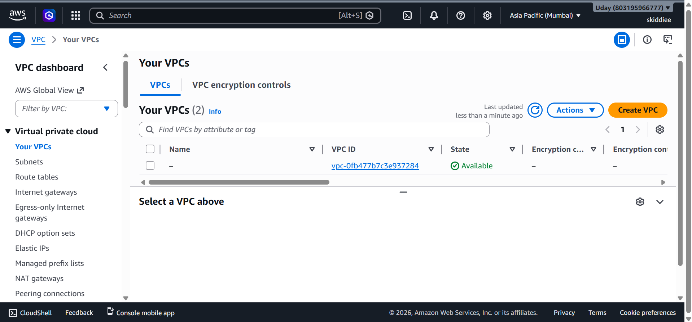
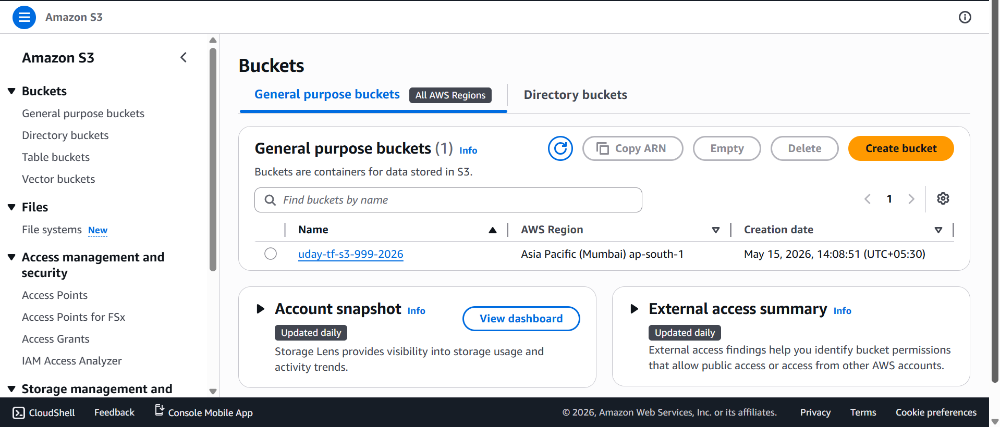
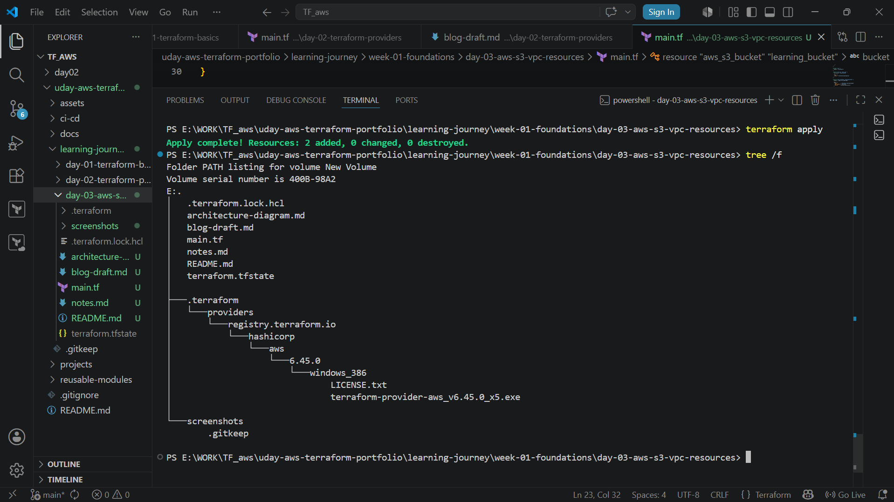

# Day 03 — AWS Resource Provisioning with Terraform (VPC + S3)

## Overview

Day 3 focused on provisioning real AWS infrastructure using Terraform.

This was the first practical infrastructure deployment in this learning journey.

The goal was to understand AWS authentication, Terraform resource provisioning, and implicit dependencies between AWS resources.

Infrastructure created in this exercise:

- AWS VPC
- AWS S3 Bucket

---

## Topics Covered

- AWS authentication for Terraform
- AWS CLI credential setup
- Terraform resource blocks
- S3 bucket provisioning
- VPC creation
- implicit dependencies
- Terraform execution workflow

---

## What I Learned

### AWS Authentication

Before Terraform can provision AWS infrastructure, it must authenticate with AWS APIs.

Common authentication methods:

- AWS CLI (`aws configure`)
- Environment variables
- IAM Roles
- AWS named profiles

Terraform uses credentials through the AWS provider.

---

### AWS S3 (Simple Storage Service)

Amazon S3 is AWS object storage.

Common use cases:

- Static website hosting
- Backup storage
- Application asset storage
- Log archival
- Data storage

Important note:

S3 bucket names must be globally unique across AWS.

---

### AWS VPC (Virtual Private Cloud)

Amazon VPC provides isolated networking inside AWS.

Capabilities include:

- Private network segmentation
- Security boundary control
- Routing customization
- Subnet architecture

---

### Implicit Dependency

Terraform automatically detects dependencies when one resource references another.

Example:

```hcl
VPC_ID = aws_vpc.main_vpc.id
```

Terraform understands:

1. Create the VPC first
2. Then create dependent resources

This is called implicit dependency.

---

## Terraform Architecture Flow

```text
Terraform Configuration
        ↓
Terraform AWS Provider
        ↓
AWS API
        ↓
AWS VPC
        ↓
AWS S3 Bucket
```

---

## Practical Work Completed

Completed during Day 3:

- Configured AWS authentication
- Initialized Terraform project
- Validated Terraform configuration
- Created AWS VPC
- Created AWS S3 bucket
- Practiced terraform init
- Practiced terraform plan
- Practiced terraform apply
- Practiced terraform destroy
- Implemented implicit dependency

---

## Repository Artifacts

| File | Purpose |
|------|---------|
| README.md | Day 3 technical documentation |
| notes.md | Personal learning notes |
| blog-draft.md | Technical blog article |
| architecture-diagram.md | Infrastructure visualization |
| main.tf | Terraform infrastructure code |
| screenshots/ | Deployment proof |

---

## Screenshots

### Terraform Plan Output


### AWS VPC Created


### AWS S3 Bucket Created


### Day 3 Folder Structure


---

## Skills Demonstrated

- AWS authentication
- Terraform infrastructure provisioning
- Infrastructure as Code
- VPC fundamentals
- S3 management
- Terraform dependency handling
- Terraform CLI workflow
- Cloud automation

---

## Next Step

Day 04 — Terraform state management.