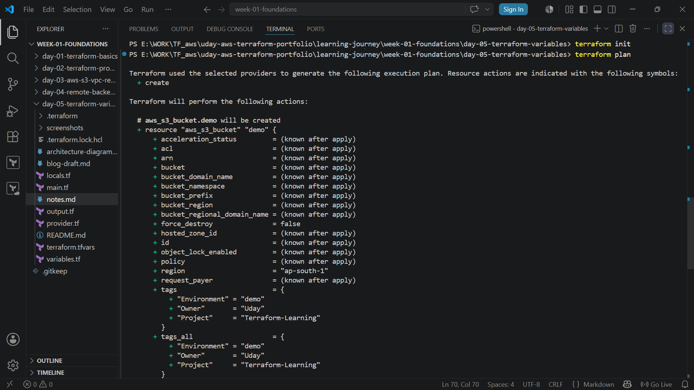
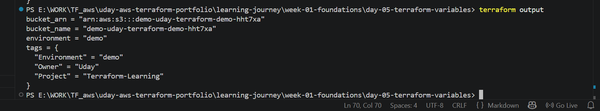
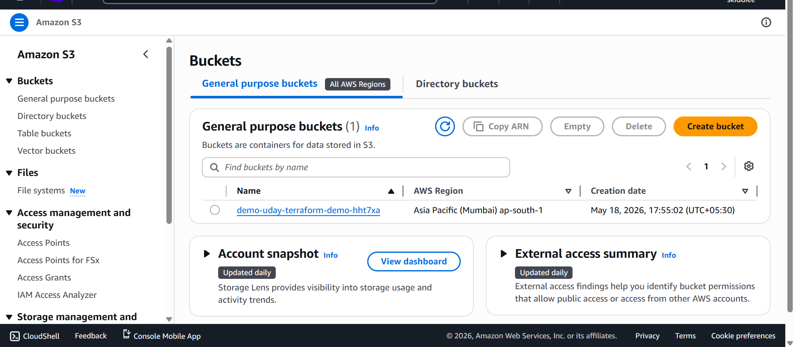
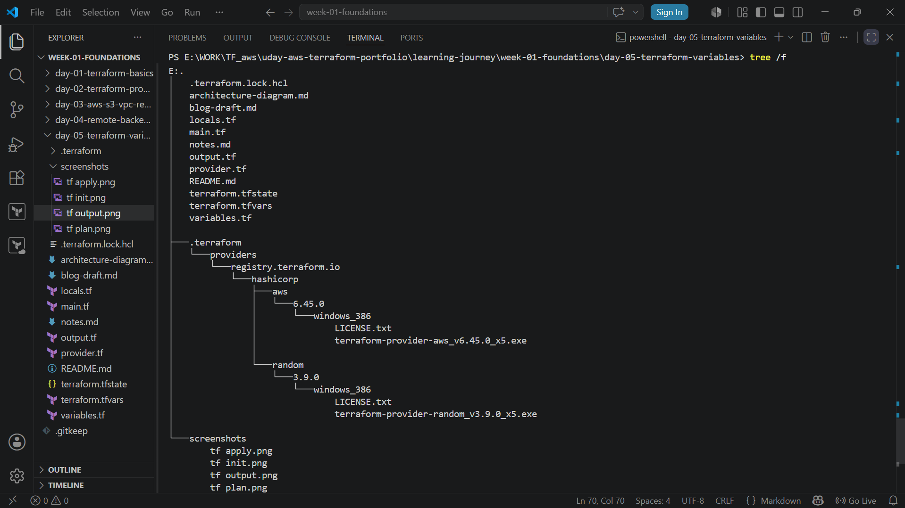

# Day 05 — Terraform Variables

## Overview

Day 5 focused on understanding Terraform variables and how they make infrastructure code reusable, flexible, and easier to maintain.

This lesson introduced the three major Terraform variable types:

- Input Variables
- Local Variables
- Output Variables

A practical AWS S3 bucket deployment was used to demonstrate how variables work together.

---

## Topics Covered

- Input variables
- Local variables
- Output variables
- Variable precedence
- terraform.tfvars
- dynamic resource naming
- reusable Terraform configurations

---

## What I Learned

### Input Variables

Input variables allow customization without changing Terraform code directly.

Example:

```hcl
variable "environment" {
  description = "Environment name"
  type        = string
  default     = "learning"
}
```

Benefits:

- reusable code
- environment customization
- cleaner configurations
- easier maintenance

---

### Local Variables

Local variables store computed internal values.

Example:

```hcl
locals {
  full_bucket_name = "${var.environment}-${var.bucket_name}-${random_string.suffix.result}"
}
```

Benefits:

- avoids repetition
- improves readability
- creates reusable internal logic

---

### Output Variables

Output variables display useful information after deployment.

Example:

```hcl
output "bucket_name" {
  value = aws_s3_bucket.demo.bucket
}
```

Useful for:

- viewing created resources
- sharing deployment information
- debugging infrastructure

---

### Variable Precedence

Terraform resolves variables in priority order:

1. Command line variables
2. terraform.tfvars
3. Environment variables
4. Default values

---

## Architecture Flow

Input Variables
      ↓
variables.tf
      ↓
Local Variables
      ↓
locals.tf
      ↓
Terraform Resource
      ↓
AWS S3 Bucket
      ↓
Output Variables
      ↓
output.tf

---

## Practical Work Completed

Completed during Day 5:

- created input variables
- created local variables
- created output variables
- configured terraform.tfvars
- deployed AWS S3 bucket
- practiced terraform output
- tested variable precedence

---

## Repository Artifacts

| File | Purpose |
|------|---------|
| README.md | Day 5 documentation |
| notes.md | Personal notes |
| blog-draft.md | Blog article |
| architecture-diagram.md | Architecture visualization |
| variables.tf | Input variables |
| locals.tf | Local variables |
| output.tf | Output variables |
| terraform.tfvars | Variable values |
| main.tf | S3 bucket resource |
| screenshots/ | Practical proof |

---

## Screenshots

### Terraform Plan


### Terraform Output


### AWS S3 Bucket


### Folder Structure


---

## Skills Demonstrated

- Terraform variables
- reusable infrastructure code
- AWS S3 provisioning
- dynamic naming
- Terraform outputs
- configuration management

---

## Next Step

Day 06 — Terraform modules